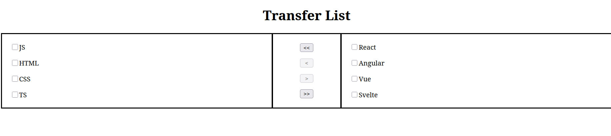
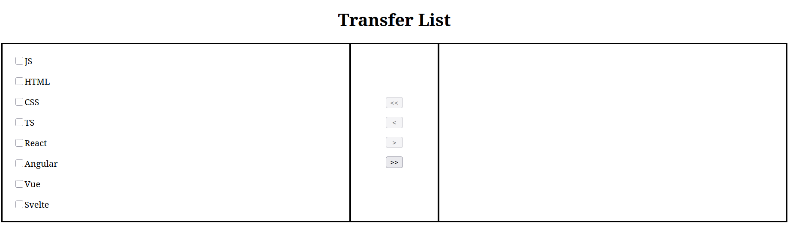
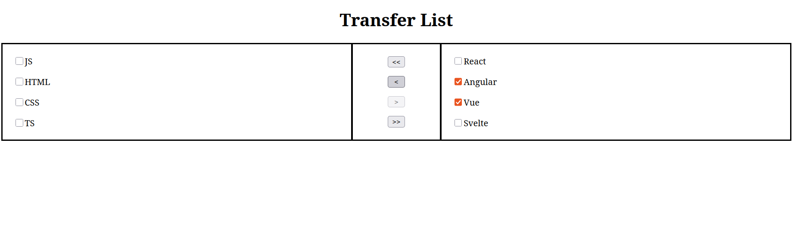

# 🔄 Transfer List

A simple and interactive **Transfer List** UI component built using **HTML**, **CSS**, and **JavaScript**. This project allows users to move items between two lists — commonly used in multi-select UIs

---

## 🚀 Features

- Select and move items between two lists
- Support for selecting single or multiple items
- Smooth interaction without page reload
- Simple, responsive layout with clean styling
- Built using vanilla JS,HTML5,CSS3 — no frameworks or libraries

---

## 🛠️ Tech Stack

- **HTML5** – Markup for the structure  
- **CSS3** – Styling and layout  
- **JavaScript (ES6)** – Dynamic list transfer logic

---

## 📸 Preview

* Bulk transfer

* Selected item transfer

 

* Link

https://transfer-list-blue.vercel.app/

